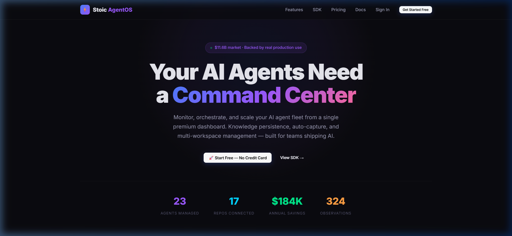

<p align="center">
  <h1 align="center">⚡ Stoic AgentOS</h1>
  <p align="center"><strong>AI 에이전트 플릿을 위한 운영체제</strong></p>
  <p align="center">AI 에이전트를 모니터링하고, 오케스트레이션하고, 지식을 영구 보존하세요 — 하나의 대시보드에서 모든 것을.</p>
</p>

<p align="center">
  <a href="./README.md"></a>
  <a href="./README.cn.md"></a>
  <a href="./README.ja.md"></a>
  <a href="./README.kr.md"></a>
  <a href="./README.es.md"></a>
  <a href="./README.pt.md"></a>
</p>

<p align="center">
  <a href="https://github.com/benjaminkernbaum-ux/stoic-agentos/stargazers"></a>
  <a href="https://github.com/benjaminkernbaum-ux/stoic-agentos/network/members"></a>
  <a href="https://www.npmjs.com/package/stoic-agentos-sdk"></a>
  <a href="https://www.npmjs.com/package/stoic-agentos-sdk"></a>
  <a href="https://stoicagentos.com"></a>
  <a href="https://github.com/benjaminkernbaum-ux/stoic-agentos/blob/master/LICENSE"></a>
</p>

<p align="center">
  <a href="https://stoicagentos.com">대시보드</a> · 
  <a href="https://stoicagentos.com/docs">문서</a> · 
  <a href="https://stoicagentos.com/signup">무료로 시작하기</a> · 
  <a href="https://www.npmjs.com/package/stoic-agentos-sdk">npm</a> · 
  <a href="#빠른-시작">빠른 시작</a>
</p>

<p align="center">
  <strong>⭐ 이 프로젝트가 마음에 드셨나요? 스타를 눌러주세요 — 스타 하나하나가 AI 에이전트를 만드는 더 많은 개발자에게 다가가는 데 도움이 됩니다!</strong><br/>
  <sub>AgentOS가 에이전트 디버깅 시간을 줄여주었다면, 스타가 최고의 감사 인사입니다 🙏</sub>
</p>

<p align="center">
  <!-- TODO: Replace with actual demo GIF recording of the dashboard -->
  
</p>

---

## 문제점

프로덕션 환경에서 AI 에이전트를 운영하고 계실 겁니다 — 코딩 어시스턴트, 데이터 파이프라인, 고객 지원 봇, 트레이딩 봇, 콘텐츠 생성기. 각각이 자율적으로 의사결정을 내리지만:

- **가시성 없음** → 에이전트가 새벽 3시에 실패해도, 월요일에야 알게 됩니다
- **기억 없음** → 같은 에이전트가 매 세션마다 같은 버그를 다시 발견합니다
- **협조 없음** → 5개의 에이전트, 5개의 사일로, 공유 지식은 제로

## 솔루션

AgentOS는 AI 플릿에 **통합 관제 센터**를 제공합니다 — 실시간 모니터링, 세션을 넘어 유지되는 영구 지식, 규모에 맞게 확장되는 사용량 기반 과금.

```
Your Agent Fleet          →  AgentOS SDK  →  Dashboard
├── Coding Assistant           3 lines       📊 Real-time status
├── Data Pipeline              of code       🧠 Shared knowledge
├── Support Bot                              📈 Usage analytics
└── Content Generator                        🔑 API key management
```

## 빠른 시작

### 1. 설치

```bash
npm install stoic-agentos-sdk
```

### 2. API 키 발급

[stoicagentos.com](https://stoicagentos.com/signup)에서 가입 → 대시보드 → 설정 → 키 생성

### 3. 첫 번째 에이전트 모니터링

```javascript
import { AgentOS } from 'stoic-agentos-sdk';

const os = new AgentOS({
  apiKey: 'sk_live_your_key_here',
  workspace: 'my-project',
});

// Wrap any function → auto-captures start, success, and errors
const myAgent = os.wrapAgent('invoice-processor', async (input) => {
  const result = await processInvoice(input);
  return result;
});

// Run it — AgentOS tracks everything
await myAgent({ invoiceId: 'INV-001' });
```

### 4. 의사결정 및 지식 캡처

```javascript
// Capture important observations
os.capture({
  type: 'decision',
  title: 'Switched to GPT-4o-mini for summarization',
  content: 'Reduced cost by 40% with no quality loss on BLEU benchmark',
});

// Persist knowledge across sessions
os.capture({
  type: 'architecture',
  title: 'Payment service uses idempotency keys',
  content: 'Always include X-Idempotency-Key header to prevent double charges',
});
```

## 기능

| 기능 | 설명 |
|---------|-------------|
| 🤖 **에이전트 모니터링** | 전체 플릿의 실시간 상태, 하트비트, 오류 추적 |
| 🧠 **지식 영구 보존** | 에이전트가 세션 간 의사결정을 기억합니다 — 더 이상 재학습 불필요 |
| 📊 **사용량 분석** | 월별 관찰 기록, 에이전트 실행 횟수, 오류율 한눈에 확인 |
| 📦 **멀티 워크스페이스** | 프로젝트, 저장소, 팀별로 에이전트를 그룹화 |
| ⚡ **자동 캡처** | `wrapAgent()`가 시작, 성공, 오류를 자동으로 기록 |
| 🔑 **API 키 관리** | 대시보드에서 키 생성, 목록 조회, 폐기 |
| 💳 **사용량 기반 과금** | 실제 한도가 있는 무료 티어, 필요할 때 업그레이드 |
| 🔒 **Row-Level Security** | Supabase에서 완전한 RLS — 조직별로 데이터 격리 |
| 🧠 **Claude 기반 인사이트** | 활동 자동 요약(Haiku 4.5) 및 장애 에이전트 진단(Sonnet 4.6 + thinking) |
| 🔐 **BYOK** | 나만의 Anthropic 키 사용 — Supabase Vault에 암호화 저장, 평문 저장 없음 |

## 왜 AgentOS인가?

| | **Stoic AgentOS** | Langfuse | AgentOps | CrewAI |
|---|---|---|---|---|
| **에이전트 모니터링** | ✅ | ✅ | ✅ | ⚠️ 오케스트레이션만 |
| **지식 영구 보존** | ✅ | ❌ | ❌ | ❌ |
| **자동 캡처 SDK** | ✅ 3줄 | ⚠️ 데코레이터 기반 | ✅ | ❌ |
| **멀티 워크스페이스** | ✅ | ⚠️ 프로젝트 단위 | ❌ | ❌ |
| **셀프서비스 대시보드** | ✅ | ✅ | ✅ | ❌ |
| **사용 한도 + 과금** | ✅ 내장 | ✅ | ❌ | ❌ |
| **오픈소스 코어** | ✅ MIT | ✅ MIT | 부분적 | ✅ |
| **설정 시간** | 3분 | 10분 | 5분 | 30분 |

## 가격

| | Free | Pro — $29/월 | Team — $79/월 | Enterprise |
|---|------|-------------|----------------|------------|
| 워크스페이스 | 2 | 10 | 무제한 | 무제한 |
| 에이전트 | 5 | 25 | 100 | 무제한 |
| 월별 관찰 기록 | 10,000 | 100,000 | 무제한 | 무제한 |
| 지식 항목 | 5 | 25 | 무제한 | 무제한 |
| 멤버 | 1 | 5 | 15 | 무제한 |

[**무료로 시작하기 →**](https://stoicagentos.com/signup)

## 아키텍처

```
┌────────────────────────────────┐
│  Your Application              │
│  ├── Agent 1                   │
│  ├── Agent 2                   │─── stoic-agentos-sdk (npm)
│  └── Agent N                   │         │
└────────────────────────────────┘         │
                                           ▼
┌──────────────────────────────────────────────────┐
│  AgentOS API (Railway)                            │
│  ├── Auth (Supabase JWT + API Keys)               │
│  ├── Observations → /api/v1/observations          │
│  ├── Agents → /api/v1/agents                      │
│  ├── Knowledge → /api/v1/knowledge-items          │
│  ├── Billing → /api/v1/billing (Stripe)           │
│  └── Webhooks → /webhooks/stripe, /webhooks/git   │
└──────────────────────────────────────────────────┘
         │                    │
         ▼                    ▼
┌─────────────┐    ┌─────────────────┐
│  Supabase   │    │  Stripe         │
│  (Postgres) │    │  (Billing)      │
│  8 tables   │    │  Checkout +     │
│  RLS on all │    │  Portal +       │
│             │    │  Webhooks       │
└─────────────┘    └─────────────────┘
```

## API 레퍼런스

| 메서드 | 엔드포인트 | 인증 | 설명 |
|--------|----------|------|-------------|
| `POST` | `/api/v1/observations` | API Key | 관찰 기록 생성 |
| `GET` | `/api/v1/observations` | API Key | 관찰 기록 목록 조회 |
| `POST` | `/api/v1/agents` | API Key | 에이전트 등록 |
| `GET` | `/api/v1/agents` | API Key | 에이전트 목록 조회 |
| `POST` | `/api/v1/agents/heartbeat` | API Key | 에이전트 하트비트 (upsert) |
| `POST` | `/api/v1/knowledge-items` | API Key | 지식 항목 생성 |
| `POST` | `/api/v1/workspaces` | API Key | 워크스페이스 생성 |
| `GET` | `/api/v1/stats` | API Key | 대시보드 통계 |
| `POST` | `/api/v1/api-keys` | JWT | API 키 생성 |
| `DELETE` | `/api/v1/api-keys/:id` | JWT | API 키 폐기 |
| `POST` | `/api/v1/billing/checkout` | JWT | Stripe 결제 시작 |
| `POST` | `/api/v1/billing/portal` | JWT | 고객 포털 열기 |

## SDK 레퍼런스

```javascript
import { AgentOS } from 'stoic-agentos-sdk';

// Initialize
const os = new AgentOS({ apiKey: 'sk_live_xxx', workspace: 'my-app' });

// Core methods
os.capture({ type, title, content, metadata })     // Log observation
os.wrapAgent(name, fn)                              // Auto-monitor function
os.getObservations({ limit, type })                 // Query observations
os.getStats()                                       // Dashboard stats

// Claude-powered insights (v2.1+)
await os.summarize({ hours: 168 })                 // AI briefing of recent activity
await os.analyzeAgent(agentId)                     // Diagnose an agent's health
await os.ask('Why did the email-agent fail?')      // Free-form Q&A
```

## Claude 통합

AgentOS는 Anthropic Claude를 활용하여 AI 기반 인사이트를 제공합니다 — 관찰 기록 요약, 에이전트 장애 진단, 플릿에 관한 자유형 질의응답.

**모델:** 빠른 요약을 위한 Haiku 4.5, 심층 진단을 위한 Sonnet 4 + adaptive thinking.

**세 가지 인터페이스:**
- **API**: `POST /insights/{summarize,analyze-agent,ask}` — API 레퍼런스 참조
- **SDK**: `os.summarize()`, `os.analyzeAgent(id)`, `os.ask(q)` (위 참조)
- **MCP server**: `agentos_summarize_observations`, `agentos_analyze_agent`, `agentos_ask` 도구

**BYOK (Bring Your Own Key):** 고객은 설정 → Anthropic API Key에서 자신의 Anthropic 계정을 통해 추론을 실행할 수 있습니다. 키는 Supabase Vault(`vault.secrets`, pgsodium으로 저장 시 암호화)에 암호화되어 저장되며, API의 service role만 접근할 수 있습니다. 조직별 키가 설정되지 않은 경우, 플랫폼은 `ANTHROPIC_API_KEY` 환경 변수로 폴백합니다.

**비용 추적:** 모든 Claude 호출은 토큰 수와 캐시 히트 정보와 함께 `anthropic_usage`에 기록됩니다. 설정 탭에서 7/30/90일 기간의 호출 횟수, 토큰 사용량, 예상 비용을 확인할 수 있습니다.

**캐싱:** 모든 요청은 `cache_control: { type: 'ephemeral' }`을 사용하여 반복되는 시스템 프롬프트가 입력 비용의 약 10%로 프리픽스 캐시에 적중합니다.

## 🌍 사용 사례

Stoic AgentOS는 자율 시스템을 모니터링, 보존, 오케스트레이션하는 현대 엔지니어링 팀들이 신뢰하고 있습니다.

<p align="center">
  
  &nbsp;&nbsp;
  
  &nbsp;&nbsp;
  
  &nbsp;&nbsp;
  
</p>

- **자율 DevOps:** 24/7 운영되는 CI/CD 분류 에이전트를 자동 모니터링.
- **엔터프라이즈 지원 플릿:** 월 10,000건 이상의 동적 관찰 기록에 걸쳐 멀티 에이전트 지원 플로우를 조율.
- **동적 콘텐츠 파이프라인:** 장기 실행 크리에이티브 비디오 생성을 위한 메모리 보존 추적.

---

## 기여하기

기여를 환영합니다! 가이드라인은 [CONTRIBUTING.md](CONTRIBUTING.md)를 참조해주세요.

```bash
# Clone the repo
git clone https://github.com/benjaminkernbaum-ux/stoic-agentos.git
cd stoic-agentos

# Install dependencies
npm install

# Start dev server
npm run dev
```

## 라이선스

MIT © 2026 [Benjamin Kernbaum](https://github.com/benjaminkernbaum-ux)

---

## 📈 스타 히스토리

[](https://star-history.com/#benjaminkernbaum-ux/stoic-agentos)

---

## 🌍 커뮤니티

- 💬 [토론](https://github.com/benjaminkernbaum-ux/stoic-agentos/discussions) — 질문하고, 아이디어를 공유하세요
- 🐛 [이슈](https://github.com/benjaminkernbaum-ux/stoic-agentos/issues) — 버그를 보고하고, 기능을 요청하세요
- ⭐ [이 저장소에 스타](https://github.com/benjaminkernbaum-ux/stoic-agentos) — 더 많은 개발자에게 다가갈 수 있도록 도와주세요
- 📋 [기여하기](CONTRIBUTING.md) — AgentOS 구축에 참여하세요

---

<p align="center">
  <strong>확신을 가지고 만들었습니다.</strong><br/>
  <a href="https://stoicagentos.com">stoicagentos.com</a><br/><br/>
  <a href="https://github.com/benjaminkernbaum-ux/stoic-agentos/stargazers"></a>
</p>
